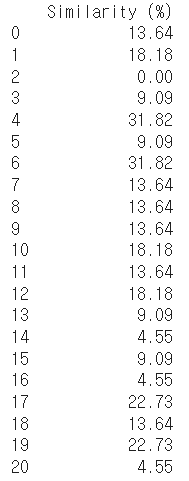

<!-- Template for PROJECT REPORT of CapstoneDesign 2024-2H, initially written by khyoo -->
<!-- 본 파일은 2024년도 컴공 졸업프로젝트의 <1차보고서> 작성을 위한 기본 양식입니다. -->
<!-- 아래에 "*"..."*" 표시는 italic체로 출력하기 위해서 사용한 것입니다. -->
<!-- "내용"에 해당하는 부분을 지우고, 여러분 과제의 내용을 작성해 주세요. -->

# Team-Info
| (1) 과제명 | LLM 기술 기반의 AI NPC를 설득해야하는 물건 판매 롤플레잉 토킹 게임
|:---  |---  |
| (2) 팀 번호 / 팀 이름 | 20-무너지지 않는 문어 |
| (3) 팀 구성원 | 이주연 (2071038): 리더, 클라이언트   김현민 (2071020): 팀원, 프롬프팅   주소연 (2076397) : 팀원, 백 |
| (4) 팀 지도교수 | 오세은 교수님 |
| (5) 팀 멘토 | 이기문 / 렐루게임즈 / 딥러닝 엔지니어 |
| (6) 과제 분류 | 산학과제 |
| (6) 과제 키워드 | 게임, AI, LLM, 음성 인식, NPC  |
| (7) 과제 내용 요약 | **길거리 판매왕**은 시뮬레이션 게임을 즐기고 NPC와의 상호작용을 선호하는 유저들을 위한 몰입형 롤플레잉 게임입니다. 기존의 고정된 대화 스크립트와 반복적인 경험에서 벗어나기 위해, ChatGPT-4o 기능을 활용해 실시간으로 NPC 대화 스크립트를 생성하고 상호작용할 수 있도록 설계되었습니다. 유저는 게임 내에서 매번 랜덤하게 생성되는 NPC와 음성 대화를 통해 설득력을 발휘하며 물건을 판매해야 하며, NPC의 성격, 고민, 판매 아이템 조합이 매번 달라져 새로운 전략과 접근 방식을 요구합니다. 이러한 방식으로 반복 플레이에서도 매번 다른 경험을 제공하여 몰입감을 높이고, 적은 자본과 시간으로도 풍부한 게임 콘텐츠를 유지할 수 있습니다.

 

# Project-Summary
| 항목 | 내용 |
|:---  |---  |
| (1) 문제 정의 | 기술의 발전에 따라 게임 콘텐츠도 더욱 성장합니다. 하지만 유저들은 여전히 게임 스토리, 게임 경험에 집중합니다. 저희는 그 중에서도 특히, 시뮬레이션 게임과 NPC와의 대화를 즐기는 유저들에 집중했습니다.    **1. Target Customer**:  시뮬레이션 게임을 즐겨하며, NPC와의 상호작용을 좋아하는 게임 유저    **2. PainPoint**:   1) 고정된 NPC와의 스크립트 (ex. 하고 싶은 말이 있어도 선택지가 없는 문제)  2) 매번 같은 경험을 제공하는 게임 (ex. 여러 번 플레이를 했을 때 항상 똑같은 플레이 경험을 주는 문제)  위의 문제점을 해결하기 위해서 지금까지 게임사에서는 방대한 스크립트를 수기로 작성하였다. 그러나 이 방식은 시간과 자금이 많이 들기 때문에 끊임없이 컨텐츠를 요구하는 게임 유저들을 충족시키기는 힘들다.   **3. 주요 기능**  1) 실시간 NPC 대화 스크립트 생성 및 상호작용 (Painpoint 1 해결) 유저는 플레이를 시작했을때 게임 플로우를 따라 자연스럽게 NPC에게 물건을 팔게 된다. 그때 NPC는 LLM 기반의 AI와 연결되어 유저에게 적합한 대답을 제공하게 된다.   2) NPC의 성격, 설득 유형, 고민, 그리고 판매 아이템의 다채로운 조합 제공 (Painpoint 2 해결) 게임은 매번 새로운 경험을 제공하기 위해 NPC의 성격, 고민, 설득 유형이 다양하게 조합되도록 설계되었습니다. 여기에 유저가 팔아야 하는 아이템까지 추가되어 수많은 조합이 가능해지고, 매 플레이마다 새로운 전략이 요구되는 독특한 게임 플레이가 구현됩니다. 이러한 설계는 플레이어가 반복적인 플레이에서도 지루함 없이 신선한 재미를 느낄 수 있도록 돕습니다. |
| (2) 기존연구와의 비교 | **길거리 판매왕**만이 가지는 차별점을 크게 두 부류의 게임과 비교하여 보았습니다. 첫 번째는 이미 인기를 끌었던 장르인 기존의 흥정 게임이고, 두 번째는 NPC에 AI를 탑재하는 시도를 한 게임입니다. 이 두 게임과 총 4가지의 요소를 선택하여 비교를 진행했습니다: 게임의 장르, NPC, 시나리오 경험, 그리고 몰입감입니다. (아래 이미지 참고)    1. **Dealer’s Life**: 흥정의 재미를 잘 살렸지만, 고정된 대화 시나리오로 인해 매번 같은 경험을 제공합니다.   2. **Uncover the Smoking Gun**: 실시간으로 답변을 생성하려는 시도가 있었지만, 여전히 제한된 시나리오에 머물러 있었습니다.   **길거리 판매왕**은 이러한 문제를 해결하기 위해 NPC와의 대화 스크립트를 실시간으로 생성하고, NPC의 다양성을 통해 매번 새로운 플레이 경험을 제공합니다. 즉, 서로 다른 방향성을 가진 두 가지 게임이 지닌 장점을 결합한 게임이라고 할 수 있겠습니다. |
| (3) 제안 내용 | **길거리 판매왕**이 제시하고자 하는 솔루션은 다음과 같습니다:  1) chatGPT 4o를 통해 실시간으로 생성되는 NPC 대화 스크립트 2) chatGPT 4o가 가능하게 한 다양한 NPC 조합 3) Unity3D와 네이버 클로바의 STT기능으로 몰입도 높인 재미있는 게임 |
| (4) 기대효과 및 의의 | 길거리 판매왕은 전통적인 게임 설계로는 해결하기 어려운 고정된 대화 스크립트와 반복적인 게임 플레이 경험 문제를 해결하여 콘텐츠 부족 문제를 해소하는 것을 목표로 합니다. 특히, 실시간 NPC 생성 및 상호작용을 통해 유저가 다양한 성격과 고민을 가진 NPC와 매번 새로운 전략을 구사하며 게임을 진행할 수 있도록 설계되었습니다. 이를 통해 플레이어는 매번 다른 경험을 제공받으며, 게임의 몰입도를 높이고 지루함을 방지할 수 있습니다.  또한, 적은 자본과 시간으로도 지속적으로 새로운 콘텐츠를 제공할 수 있어 게임 개발 비용을 효율적으로 관리할 수 있습니다. 이러한 차별화된 게임 설계는 게임 업계에서 새로운 가능성을 제시하며, 혁신적인 콘텐츠 제공 방식에 기여할 것입니다. |
| (5) 주요 기능 리스트 |**주요 기능**:  **1. 실시간 NPC 대화 스크립트 생성 및 상호작용**	 게임을 시작했을때, 유저는 설계된 게임 플로우에 따라 NPC에게 물건을 판매하게 된다. 이때 NPC와의 대화는 자연어로 진행할 수 있으며, 텍스트 혹은 음성으로 입력을 받는다. 유저가 어떠한 대화를 진행하든 NPC는 자신의 성격과 유저의 말에 적합한 답변을 출력하게 된다.    **2. 협상 및 설득 메커니즘**	 유저는 NPC와의 상호작용을 통해 NPC가 물건을 사도록 유도해야한다. 이때 설계된 협상 메커니즘은 설득력 점수를 기반으로 구현되어 있다. chatGPT는 유저의 발언을 평가하고 이래 따라 물건 구매를 결정하게 된다. 이 기능은 백엔드에서 협상 로직을 통해 처리되며, NPC는 실시간으로 협상 성공 여부를 판단하고 판단에 맞는 반응을 출력 하게 된다.   **3. 예측 불가능한 NPC 조합으로 매번 새로운 경험 제공** NPC는 게임을 시작할 때마다 무작위로 조합된 외형, 성격, 대화 스타일을 갖추고 등장합니다. 이를 위해 사전에 정의된 외형 데이터베이스와 성격, 고민, 아이템 각각의 템플릿이 마련되어 있으며, NPC Generator 모듈을 통해 다양한 조합이 구현됩니다. 이 모듈은 사전 정의된 데이터베이스에서 무작위 값을 가져와 NPC의 외모와 성격을 설정하며, ChatGPT API를 활용해 NPC의 대화 반응을 실시간으로 생성합니다. 플레이어의 대화 내용에 따라 대화 스타일이 즉각 변동되기 때문에, 매번 새로운 NPC와 상호작용할 수 있어 플레이어에게 신선한 경험을 제공합니다.   **4. STT(음성인식)** 통합	플레이어가 직접 음성으로 NPC와 대화를 나누는 기능이 구현되었습니다. STT(Speech-to-Text) 기능은 플레이어의 음성을 텍스트로 변환하여 ChatGPT로 전송됩니다. 이 기술은 실시간으로 작동하며, 플레이어의 음성 입력에 따라 NPC의 반응이 변화하는 자연스러운 대화 경험을 제공합니다.|

 
 
# Project-Design & Implementation
| 항목 | 내용 |
|:---  |---  |
| (1) 요구사항 정의 | **1. 시퀀스 다이어그램**  https://drive.google.com/file/d/1idm4mgx2YNl98Qh_G3UiVoTwoUR5x08w/view?usp=sharing  이 시퀀스 다이어그램은 사용자가 NPC와 상호작용하며 물건을 판매하는 게임의 진행 흐름을 나타냅니다. 다이어그램은 사용자(User), Unity, Django, 그리고 GPT API의 네 가지 주요 컴포넌트 간의 상호작용을 설명하고 있으며, 각 단계에서의 작업 순서를 명확히 나타냅니다.   **• 사용자 상호작용** 사용자가 게임 내에서 물건을 구입하고, 캐릭터와 NPC의 상호작용을 시작합니다. 이때 Unity는 사용자 진행 상태를 업데이트하며, NPC와 대화를 시작할 수 있는 상태로 전환합니다.   **• NPC 생성 및 초기화** NPC의 성격은 Django를 통해 초기화되며, 게임에서 실시간으로 NPC의 반응을 ChatGPT API로부터 받습니다. 이를 통해 플레이어의 대화에 맞춘 동적 응답이 제공됩니다.   **• 대화 및 협상 진행** 사용자가 NPC와 대화를 이어가며, 대화 내용과 설득 여부에 따라 진행 흐름이 달라집니다. 플레이어는 협상을 통해 물건을 판매해야 하며, 각 대화 단계마다 NPC의 반응이 실시간으로 생성되어 상호작용의 몰입감을 높입니다.  **• 거래 및 평가** 사용자가 협상을 통해 물건의 가격을 제시하고 NPC와의 거래를 완료합니다. 이후 대화가 종료되며, 평가 결과에 따라 플레이어에게 피드백이 제공됩니다.   **2. 기능적 요구사항 (Functional Requirements)**|
| (2) 전체 시스템 구성 |  **메인 모듈 1: 클라이언트 (Client)** 클라이언트는 게임을 플레이하는 유저가 상호작용하는 부분입니다. 이 모듈은 주로 프론트엔드로 구성되며, NPC와의 대화, 음성 인식(STT) 등 유저 인터페이스를 담당합니다.  **1. 서브: 데이터 관리:**  게임 파일에는 NPC와 아이템에 대한 정보가 JSON 형식으로 저장되어 있습니다. 데이터 관리자는 해당 파일로부터 정보를 추출하고 관리합니다. 유저가 NPC와 접촉하게 되면, NPC 관리자는 데이터 관리자에게서 NPC 성격을 랜덤으로 받아와 NPC에 부착합니다. 이는 이후 서버 관리자를 통해 ChatGPT 시스템 프롬프트에 추가됩니다.  **2. 서브: STT 기능:**  STT(Speech-to-Text) 기능을 통해 유저의 음성을 Naver Clova API를 활용하여 인식합니다. Unity에서는 유저의 입력을 녹음 후 바이트 형식의 배열로 변환하고, 이를 서버에 전송하여 변환된 텍스트를 받습니다.  **3. 서브: NPC 랜덤 생성:**   NPC 관리자는 Data 관리자가 추출한 NPC 키워드와 아이템 정보를 받아와 랜덤으로 NPC에게 부착해줍니다. 그 중 외양은 NPC 특성 키워드(성별, 나이, 특이사항)를 고려하여 이에 맞는 외양이 부여됩니다. 결과적으로 유저는 플레이를 하면서 같은 NPC를 만날 확률이 현저히 낮아집니다.  **4. 서브: 서버 관리자:**   플레이어와 ChatGPT의 1대1 상호작용을 담당합니다. 서버는 NPC 및 아이템 정보와 유저의 input을 ChatGPT에 전달하고, 그 답변을 받아 정제합니다. 이를 통해 플레이어에게 적절한 응답을 제공합니다. 게임 단계의 명확성을 위해 FSM(유한 상태 기계) 시스템을 도입하여 ChatGPT의 웹 요청 지연을 최소화합니다.    **메인 모듈 2: 서버 (Server)**  서버는 실질적으로 게임의 핵심 로직이 실행되는 곳으로, 서버와 AI 모델이 포함됩니다.  **1. 서브: Django 서버:**  유저가 텍스트나 STT를 통해 대화를 진행하면 Azure에 배포된 Django 서버가 유저와 OpenAI 사이를 중계합니다. 클라이언트에 있는 서버 관리자가 NPC 및 아이템 정보와 현재 상황을 Django에 보냅니다. Django는 받아온 정보와 설득 프롬프트를 결합하여 chatGPT에 전달합니다. 이후 반환된 답변을 다시 unity에 있는 서버관리자로 보내주게 됩니다.  **2. 서브: OpenAI 연동:**  Django는 전달된 정보에 따라 OpenAI에게 응답을 구하고, GPT가 답변을 생성한 후 이를 Unity로 전달합니다.  **3. 서브: 협상 프롬프트:**  작성된 프롬프트는 서버에 저장되니다. 프롬프트의 뼈대에 따라 chatGPT는 유저의 말을 평가하고 설득력 지표를 계산합니다.|
| (3) 주요엔진 및 기능 설계 |**[1. 클라이언트]**  **A) 데이터 관리자**    **데이터 관리자 1: 데이터 저장 및 변환** 로컬 데이터에는 NPC의 고민 정보, 아이템 정보, 그리고 NPC의 기본 정보가 JSON 형식으로 저장되어 있습니다. 데이터 관리자는 이 정보를 JSON에서 리스트로 변환한 후, 클라이언트에서 사용할 수 있도록 딕셔너리나 ScriptableObject 같은 자료 구조에 담아 관리합니다.    **데이터 관리자 2: 데이터 불러오기 및 가공**  Npc, 고민, 아이템 정보를 JSON으로부터 리스트로 불러온 뒤, 클라이언트에서 사용하는 적절한 자료 구조로 변환합니다. 모든 데이터는 데이터 관리자(Singleton)에서 메모리에 유지되며, 다양한 모듈에서 이를 참조할 수 있습니다. 각 모듈은 필요한 대로 데이터를 가공해 사용합니다. 예를 들어, cashManager은 물건의 가격만 가공하여 저장합니다.   **B) NPC 관리자와 채팅 관리자**  **NPC 관리자 1: 랜덤 NPC 생성**  데이터 관리자로부터 가공된 정보를 바탕으로 NPC 관리자에서는 랜덤으로 NPC의 성격과 말투, 최근 고민과 사고 싶은 물건, 유저가 팔아야하는 물건을 정제합니다.   **NPC 관리자 2: 외모 설정**   데이터 관리자에서 받은 정보에 따라 NPC의 외모를 설정합니다. NPCMeshManager: NPC의 외모 Mesh를 키로 카테고리화합니다. 예를 들어, 성별(Male/Female), 연령(Young/Old), 또는 특이성(Special/Normal)에 따라 분류합니다. 젊은 캐릭터의 경우 후드티나 반바지 같은 Mesh가 선택되고, 특이한 캐릭터는 핫도그맨이나 외계인 같은 Mesh가 선택됩니다. NPC의 ScriptableObject에 저장된 성별 및 연령 정보를 참조해 적절한 Mesh를 결정합니다.   **채팅 관리자 1: 대화 응답 및 UI 전달**     **a. 답변 처리:**  GPT가 응답을 보낼 때, `yourReply`라는 키 뒤에 한국어 응답이 값으로 포함됩니다. 이 값은 `replySubManager`로 전달되어 Chat UI를 통해 플레이어에게 표시됩니다. `replySubManager`는 플레이어와 GPT의 응답을 관리하며 UI 상에 대화를 표시합니다.  **b. 감정 애니메이션:** GPT가 응답을 보낼 때 감정 키를 포함합니다. NPCAnimManager는 이 감정을 Positive, Neutral, 또는 Negative로 분류하고, Unity의 Animator가 대응하는 애니메이션을 실행해 NPC가 감정적으로 반응하게 합니다.  **c. 설득 메커니즘**  설득은 별도로 관리됩니다. 설득 수치가 누적되며, 최저선과 최고선을 기준으로 대화의 진행 방향을 결정합니다. 설득 수치가 최고선을 넘으면 서버에 종료 신호를 보내 GPT에게 구매 완료를 요청하고, 최저선 미만이면 거절 및 종료 신호를 보내 대화를 마칩니다. 한 번에 설득 수치는 -4.5에서 +4.5 사이에서 결정되며, 강한 부정/긍정(-3 이하, +3 이상)일 때는 그 이유와 함께 시각적 피드백을 제공합니다.   **C) 대화 관리자**  **1. STT 음성 인식**  Unity에서는 유저의 입력을 Wav 파일로 받아 이를 바이트 형식의 배열로 변환하고, 이를 서버에 전송.    **[2. 서버]**      **A) 데이터 전송 및 대화 관리**   **a. 프롬프트 구성 및 전달**  클라이언트로부터 받은 고민, 아이템, 성격 정보를 포함해 ChatGPT에 프롬프트를 전송합니다. 클라이언트가 전송한 토큰을 변수에 저장하며, SendType에 따라 다르게 처리합니다.  **-ChatInit 상태:** NPC의 설득 유형별로 프롬프트를 조립한 후 GPT에 전달합니다.  **-Chatting 상태:** ChatInit과 동일하되 프롬프트 조립 단계만 생략됩니다.  **-Endpoint 상태:** 대화 종료 요청을 보내고 기존 세션 정보를 삭제합니다.|
| (4) 주요 기능의 구현 | **[설득 메커니즘 구현]**  **1. 설득 유형 구현**   데모를 진행하여 유저 데이터를 수집한 결과, 저희 팀은 설득 유형을 4가지로 나누어 보다 다양한 접근으로 NPC를 설득할 수 있게 수정하였습니다. 감정형, 논리형, 아부형, 플러팅형으로 총 4가지의 설즉 유형이 있습니다. NPC는 4가지의 설득유형 중 좋아하는 유형과 싫어하는 유형을 가지고 있을 수 있습니다.   위 사진은 감정형을 좋아하는 캐릭터의 프롬프트와, 감정형을 싫어하는 캐릭터의 프롬프트의 예시입니다. 다른 설득 유형 전부 해당 프롬프트와 유사합니다. 설득 유형별 좋아하는 프롬프트와 싫어하는 프롬프트, 보통으로 여기는 프롬프트가 존재하며 현재 총 12가지의 설득유형이 존재합니다.  **2. 사용자 태도 평가**  설득 유형과 별개로 NPC들은 판매자의 태도를 평가합니다. 이로써 보다 자연스러운 설득 매커니즘을 구현할 수 있게 되었습니다.  **3. persuasion 계산**   chatGPT가 산출한 persuasion을 저장하여 총합이 10이 넘는다면 설득 성공, 총합이 -5 아래로 내려간다면 설득 실패입니다.  **4. 대답 format 지정**  항상 동일한 format의 대답을 받기 위해 chatGPT가 이해하기 편한 컴퓨터 수식을 활용하였습니다. 또한, json 포맷으로 답변을 강제하여 게임에 지장이 없도록 설계하였습니다.   **[NPC 랜덤 구현]**  **1. NPC 성격 및 말투**   사진과 같이 NPC의 기본 정보가 JSON 형식으로 저장되어 있습니다. 유저가 게임을 시작했을때 해당 NPC의 정보 중 하나가 랜덤으로 NPC에게 부착됩니다.  **2. 고민 유형 및 아이템**  위 사진과 같이 NPC의 고민과 아이템 정보가 JSON 형식으로 저장됩니다. NPC의 고민이 랜덤으로 NPC에게 부착됩니다. 추후 아이템은 고민에 맞는 카테고리 범위 내에서 정해집니다. 유저 역시 팔아야하는 물건을 랜덤으로 받게 됩니다. 이런 랜덤 NPC, 아이템 생성 구조로 유저들은 더 다양한 NPC와 게임 플레이를 즐길 수 있습니다.  위와 같이 랜덤으로 캐릭터의 성격과 설득 유형, 고민과 아이템이 배정된 것을 확인할 수 있습니다.  **[STT 음성 인식]**    **마이크 설정 및 초기화:**   - 사용 가능한 마이크를 탐색하고 첫 번째 장치를 `_microphoneID`로 설정합니다. - 환경 변수에서 Naver Clova STT API의 인증 키를 가져옵니다.  **녹음 시작 및 종료:**  - StopRecording() 함수는 녹음을 종료하고, 녹음된 오디오 데이터를 API에 전달하기 위해 WAV 형식의 바이트 배열로 변환합니다.  **WAV 변환:**  - GetWavBytesFromAudioClip() 함수는 AudioClip을 WAV 바이트 배열로 변환합니다. 변환을 위해 WavUtility 라이브러리를 사용해야 합니다  **API 요청 전송:**  - - `PostVoiceToAPI()` 코루틴은 녹음된 음성을 Naver Clova STT API로 전송합니다. - 서버 응답을 JSON 형식으로 받아서 텍스트를 추출하고 UI에 표시합니다.  **응답 파싱:**  - VoiceRecognize 클래스는 JSON 응답에서 음성 인식 결과 텍스트를 가져옵니다.  **[기타 기능]**   **UI/UX 개선**   현재 UI를 보다 깔끔하고 명확하게 개선하고자 합니다. 현재 개선하고 있는 부분은 시작 화면, 채팅화면, 엔딩 UI 화면입니다.  **튜토리얼 개선**    게임의 전달력이 낮다는 평가를 들어 개선중에 있습니다. 게임 플레이가 하나에 커다란 튜토리얼이 되도록 기획하여 자연스러운 이해를 돕고 있습니다.|
| (5) 기타 |데모 영상 링크: https://youtu.be/F6hpyxqv7Z0 |
 

# Evaluation
## 실시간 NPC 대화 스크립트 생성 및 상호작용
| 항목 | 내용 |
|:---  |---  |
|평가 항목 및 선정 이유|**실시간 NPC 대화 스크립트 생성 및 상호작용**을 평가하기 위해 선정되었습니다. 이 핵심 기능에서 중요한 부분은 NPC와의 자연스러운 대화를 통해 몰입감을 제공하고, 다양한 답변 생성을 통해 반복되는 NPC 상호작용을 방지해 새로운 경험을 만들어내는 것입니다.   **1. NPC가 반응에 맞는 답변을 하는가?** - **선정 사유:** 이 항목은 생성형 AI를 활용해 **플레이어와 NPC의 상호작용을 자연스럽게 만드는지**를 평가하기 위해 중요합니다. NPC가 플레이어의 질문이나 행동에 **적절한 맥락으로 반응**해야만 게임의 몰입감이 유지되기 때문입니다. 자연스러운 대화 흐름은 게임의 핵심 목표인 설득 과정을 성공적으로 진행하기 위한 필수 요소입니다.  **2. NPC가 다양한 답변을 제공하는가?** - **선정 사유:** 이 항목은 생성형 AI를 활용할시 기존 선택지 선택 형식에 비해 얼마나 더 다양한 답변을 제공하는지를 평가하기 위해 중요합니다. AI를 통해 생성된 대화가 얼마나 다양한 선택지를 제공하여 게임의 재미를 강화할 수 있는지를 판단하기 위해 이 항목을 선정하였습니다. |
|평가 기준|**1. 반응 적절성 (평가 항목 1과 연결):** - NPC의 답변이 플레이어의 입력과 일치하는지 점수로 평가 (1~5점 척도). - 예: 맥락에 맞지 않는 대답(1점)부터 맥락상 올바른 대답(5점)까지. - 평균 점수가 4.0 이상이면 "반응 적절성 우수"로 판단.  **2. 답변 다양성 (평가 항목 2와 연결):** - 타 거래 게임과 길거리 판매왕의 NPC 텍스트를 비교하여 대화 주제 및 키워드의 유사도를 분석. - 유사도 기준: 중복 단어 수 ÷ 전체 단어 수 × 100 (%). - 입출력의 키워드의 유사도 차이가 30% 미만일 경우 "다양성 우수"로 판단.  예: 유사도가 70% 이상: 다양성이 낮음. 유사도가 30% 이하: 다양성이 높음. |
|평가 방식|**1. 반응 적절성 평가 방식:** - 설문을 통해 32명의 플레이어에게 NPC 대화의 자연스러움을 점수로 평가하도록 요청. - 점수 데이터를 기반으로 평균 점수를 산출.  **2. 답변 다양성 평가 방식:** - 두 게임의 NPC 상호작용 텍스트를 수집하여 각 대화 주제 및 키워드를 비교. - 각 주제별 중복 키워드 수를 기준으로 유사도를 계산하여 비교 분석.|
|평가 내용/결과|**1. NPC 대화의 자연스러움 평가 결과:**  - 설문 응답 결과: 56.3%의 플레이어가 "매우 자연스럽다"(5점)로 평가. **- 평균 점수: 4.34점.**  **2. NPC 대화의 다양성 평가 결과:**  - 조사 결과: 타 거래 게임의 NPC 상호작용 텍스트 유사도: 69.4%. - 길거리 판매왕의 NPC 상호작용 텍스트 유사도: 9%. - 즉, 길거리 판매왕은 **NPC 대화의 다양성이 타 게임 대비 높다.**|
|결론| - NPC 대화의 자연스러움과 다양성은 플레이어들에게 긍정적인 평가를 받았으며, **게임 몰입감을 향상시키는 데 기여**했음. - 생성형 AI를 활용한 텍스트 생성이 대화 옵션을 더욱 **다양하게 제공**할 수 있음을 확인함.|

## 랜덤 NPC 생성 기능
| 항목 | 내용 |
|:---  |---  |
|평가 항목 및 선정 이유| 해당 항목은 **랜덤 NPC 생성 기능**의 구현과 효과를 평가하기 위해 선정되었습니다. 이 기능의 핵심 목표는 매번 새로운 NPC를 제공함으로써 반복 플레이에서도 신선함을 유지하고, AI가 생성한 NPC가 인간 제작 NPC 수준의 자연스러움과 재미를 제공하는 것입니다.  **1. NPC가 중복되지 않는가?** **- 선정사유:** 이 항목은 **랜덤 NPC 생성 기능이 제대로 작동하는지**를 평가하기 위해 중요합니다. AI가 생성하는 NPC가 **중복되지 않고 다양하게 생성**되어야 플레이어가 매번 새로운 캐릭터와 상호작용할 수 있습니다. 이는 게임의 핵심 목표인 **반복 플레이에서도 새로운 경험**을 제공하기 위한 필수 요소입니다.    **2. AI 제작 NPC가 인간 제작 NPC만큼 자연스러운가?** **- 선정사유:** 이 항목은 AI가 생성한 NPC의 **스토리텔링과 상호작용의 품질**을 평가하기 위해 중요합니다. 랜덤으로 생성된 NPC라 하더라도 **인간이 제작한 NPC처럼 자연스럽고 설득력 있는 대화와 행동**을 보여야만 플레이어가 몰입감을 느낄 수 있습니다. 이 항목을 통해 AI가 인간 제작 수준의 **창의성과 재미**를 구현할 수 있는지를 검증하며, 이는 게임의 핵심 기능인 **랜덤 NPC 생성**의 완성도를 높이는 중요한 기준이 됩니다. |
|평가 기준|**1. NPC 중복 평가 기준 (평가 항목 1과 연결):** - AI가 생성한 NPC 10명을 랜덤으로 추출하여 중복도를 계산. - 중복도 추출 계산식: https://colab.research.google.com/drive/1sn8r8cAQLkL61YL393-IrZMdQK6cnZK-?usp=sharing - 중복 속성이 전체 속성의 35% 이하로 확인되면 성공적인 다양성을 확보한 것으로 간주.  **2. AI와 인간 제작 NPC 비교 기준 (평가 항목 2와 연결):** 설문을 통해 NPC의 재미, 개성, 자연스러움 측면에서 선호도를 조사. 각 항목의 점수를 바탕으로 평균 평가 결과를 도출. |
|평가 방식|**1. NPC 중복 평가 방식:** - 랜덤으로 생성된 NPC 10명의 특성을 비교하여 중복 속성을 계산. - 중복 속성이 전체 속성의 35% 이하일 경우 성공적인 다양성을 확보했다고 간주.  **2. AI 제작 NPC와 인간 제작 NPC 비교 평가 결과:** - 플레이어 31명을 대상으로 설문을 통해 스토리 모드(인간 제작 NPC)와 무한 모드(AI 제작 NPC)의 차이를 평가. - 평가 키워드: 재미, 자연스러움, 개성. - 인간이 제작한 NPC와 AI 제작 NPC의 경쟁력을 비교.  - 시간과 비용을 고려하여 과반수 이상이 인간 제작 NPC와 AI 제작 NPC의 차이를 느끼지 못하거나, AI 제작 NPC를 더 재밌다고 생각했을 경우 AI 제작 NPC의 경쟁력이 충분하다고 간주.|
|평가 내용/결과|**1. NPC 중복 평가 결과:**  *colab 링크 참고* - 랜덤으로 생성된 NPC의 속성 중복도는 **평균 35% 이하**로 확인. - 유저들은 다른 캐릭터와 대화한다고 느낌.  **2. AI 제작 NPC와 인간 제작 NPC 비교 평가 결과:**  - 조사 결과: 응답자의 **절반 이상(16명)**이 AI 제작 NPC와 인간 제작 NPC의 차이가 없거나, AI 제작 NPC가 더 자연스럽고 재미있다고 평가. - 직접 만든 NPC에 비해 AI 제작 NPC는 무한하고 빠른 생성이 가능. |
|결론| - 랜덤 NPC 생성 기능은 다양성과 자연스러움 측면에서 높은 평가를 받았음. -  AI 제작 NPC가 인간 제작 NPC와 비교했을 때 충분히 경쟁력 있고, 플레이어 경험에 긍정적인 영향을 미친다는 점을 보여줌.|

## 플레이어 만족도 및 NPC 대화의 재미 평가
| 항목 | 내용 |
|:---  |---  |
|평가 항목 및 선정 이유|해당 항목들은 실시간 NPC 대화 스크립트 생성 및 랜덤 NPC 생성 기능이 **게임의 재미와 차별화된 경험을 제공**하는지를 평가하기 위해 선정되었습니다. 이 기능의 목표는 플레이어에게 반복 플레이의 동기를 부여하고, 다른 게임에서는 경험할 수 없는 몰입감 높은 NPC 상호작용을 제공하는 것입니다.  **1. 게임을 재플레이할 의사가 있는가?** **- 선정사유:** 이 항목은 게임이 **반복적으로 플레이할 가치가 있는지**를 평가하기 위해 중요합니다. 랜덤하게 생성되는 NPC와 실시간으로 상호작용하는 기능은 매 플레이마다 새로운 경험을 제공합니다. 이로 인해 플레이어가 게임을 다시 찾고 싶다는 의사를 보인다면, 게임의 **몰입도와 만족도**가 높다는 것을 의미하며, 이는 게임의 **장기적인 성공 가능성**을 검증하는 중요한 기준이 됩니다.   **2. NPC 대화의 재미가 타게임 대비 높은가?** **- 선정사유:** 이 항목은 **길거리 판매왕만의 차별화된 경험**을 평가하기 위해 중요합니다. 기존 게임의 고정된 스크립트와 선택지 기반 대화와는 달리, 생성형 AI를 활용한 NPC 대화는 **더 자연스럽고 예측 불가능한 재미**를 제공합니다. 이 항목을 통해 NPC와의 상호작용이 타 게임 대비 얼마나 재미있고 몰입감 있게 설계되었는지를 검증하며, 이는 게임의 **경쟁력**과 **차별성**을 확인하는 중요한 요소입니다. |
|평가 기준|**1. 재플레이 의사 평가 기준: (평가 항목 1과 연결):** - 설문 점수를 기반으로 다시 플레이하고 싶다는 의사가 높은(4점 이상) 플레이어 비율이 50% 이상일 경우 긍정적으로 평가.  **2. NPC 대화 재미 평가 기준 (평가 항목 2와 연결):** 설문 점수를 기반으로 "재미있다"(4점 이상)고 응답한 비율이 60% 이상일 경우 NPC 대화가 경쟁력 있다고 평가.|
|평가 방식|**1. 재플레이 의사 평가 방식:** - 32명의 플레이어를 대상으로 설문을 진행하여 "다시 플레이하고 싶은가?"라는 질문에 1\~5점 척도로 답변을 받음. - 응답 결과를 기반으로 4점 이상 응답 비율을 분석.  **2. AI 제작 NPC와 인간 제작 NPC 비교 평가 결과:** - 동일한 설문 방식으로 "길거리 판매왕의 NPC 대화가 더 재미있는가?"라는 질문에 1\~5점 척도로 답변을 받음. - 4점 이상 응답 비율을 분석하여 재미의 우위를 평가.|
|평가 내용/결과|**1. 게임 재플레이 의사:**  - 설문 결과: - 응답자 62.5%가 "매우 다시 플레이하고 싶다"(5점)로 응답. - **4점 이상 응답자 비율은 84.4%**로 확인됨.  **2. NPC 대화의 재미:**  - 설문 결과: - 응답자 65.6%가 "길거리 판매왕의 NPC 대화가 더 재미있다"(5점)로 응답. - 4점 이상 응답자 비율은 84.4%로 확인됨.|
|결론| - 게임의 재플레이 의사는 응답자의 84.4%가 긍정적이며, 이는 게임에 대한 만족도와 몰입도가 높다는 것을 의미. - 길거리 판매왕의 NPC 대화는 재미 요소에서 경쟁력 있는 결과를 보였으며, 이는 플레이어의 긍정적인 경험을 강화할 수 있음.|

# 최종 결론

| 항목 | 내용 |
|:---  |---  |
|과제의 전체 내용|본 프로젝트 **길거리 판매왕**은 생성형 AI와 랜덤 NPC 시스템을 활용해 플레이어와 NPC 간의 실시간 대화와 상호작용을 구현한 몰입형 롤플레잉 게임입니다. 기존 게임의 고정된 스크립트와 반복적인 경험의 한계를 극복하고, 다양한 경험과 전략을 제공하는 것을 목표로 했습니다.|
|프로젝트의 중점 아이디어 및 기술/구현 내용|**◦ 생성형 AI 기반 실시간 NPC 대화 스크립트 생성:** 플레이어의 질문과 행동에 맞춰 AI가 즉시 대화 스크립트를 생성하며, 자연스러운 상호작용이 가능하도록 구현하였습니다.  **◦ 랜덤 NPC 생성 시스템:** NPC의 성격, 고민, 판매 아이템 조합을 AI로 자동 생성하여 매번 다른 NPC와의 상호작용을 제공합니다.|
|평가 결론|이번 평가를 통해 생성형 AI를 활용한 NPC 대화 스크립트 생성 및 상호작용 시스템이 플레이어들에게 긍정적으로 수용되었음을 확인했습니다.  **◦ NPC 대화의 자연스러움:** 설문 응답자 중 56.3%가 "매우 자연스럽다"고 평가하였으며, 평균 점수는 4.34점으로 높은 수준을 기록. **◦ NPC 대화의 다양성:** 조사 결과, 길거리 판매왕의 NPC 대화 텍스트 유사도는 **9%**로, 타 거래 게임의 69.4% 대비 월등히 낮아 대화의 다양성이 뛰어남을 확인. **◦ 랜덤 NPC 다양성:** 랜덤으로 생성된 NPC의 속성 중복도가 평균 35% 이하로 확인되어, 플레이어가 매번 새로운 캐릭터와 상호작용한다고 느낄 가능성이 높음. **◦ AI 제작 NPC와 인간 제작 NPC 비교:** 절반 이상의 참여자가 AI 제작 NPC가 인간 제작 NPC와 차이가 없거나 낫다고 평가.  **◦ 게임 재플레이 의사:** 84.4%의 플레이어가 다시 플레이할 의사가 있다고 응답, 게임의 높은 만족도를 입증.  **◦ NPC 대화의 재미:** 응답자의 65.6%가 길거리 판매왕의 NPC 대화가 타 게임보다 재미있다고 평가하며, NPC 상호작용의 경쟁력을 보여줌.   결론적으로, 생성형 AI를 활용한 시스템은 자연스러움, 다양성, 재미 측면에서 플레이어들에게 성공적인 평가를 받았으며, 길거리 판매왕은 AI를 적절히 잘 이용한 게임임을 확인하였습니다.|
|앞으로 개선 상황|**NPC 대화의 자연스러움 강화:** AI가 생성하는 대화 스크립트를 더 보안하여 NPC 대화 흐름을 개선. 특수 상황이나 감정적 대화 흐름에 반응하는 로직을 추가해 더욱 현실감 있는 상호작용 제공.  **랜덤 NPC의 개성 및 다양성 강화:** NPC의 속성과 대화 스타일을 더욱 세분화하여 개성을 극대화. 다양한 키워드와 상황별 대화 패턴을 추가로 도입해 NPC 간 차별화를 극대화.  **재플레이 경험 최적화:** AI 대화를 플레이어의 과거 선택과 연계하여, 새로운 대화 흐름을 생성하는 방식으로 몰입감을 강화. 장기적으로 NPC의 성장, 플레이어 관계 변화 등 스토리 전개 시스템 도입을 검토.|
